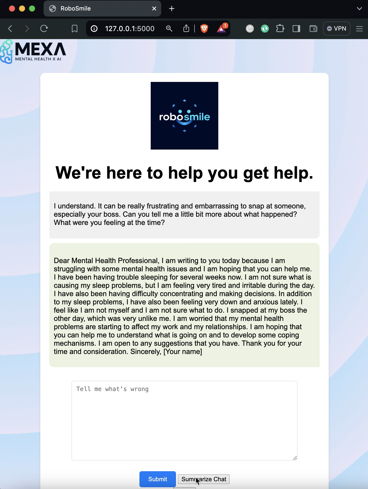

# RoboSmile

### Repo for the RoboSmile team's MEXA mental health AI hackathon project. We want to use large language models to help patients communicate their mental state clearly and with minimal distress in the early stages of treatment.

Members (in alphabetical order):
- Limou Dembele
- Adam Harris
- Clàudia Llinares
- María Navas-Loro
- Luis Torrao

------------------------

### This codebase has two main parts:

1) Jupyter notebooks in Notebooks folder, dedicated to simulating patients with various mental health issues and different communication abilities, summarising their text, and classifying their output. This line of work is to prepare to finetune the model that patients interact with, so as to preserve the most clinically relevant features of their converstaion. 

The notebooks can be interacted with on Google Colab.
 
2) A Flask app which allows users to interact with a specially prompted and constrained version of Gemini. This LLM is tasked with helping the user hone a description of their problem. Once the user feels hey have managed to express enough, the can hit 'Summarize Chat' to recieve a personalised letter to send to a practitioner.

To play with the Flask app, clone the repo, make a virtual env or conda env using requirements.txt, activate the env and type 'python app.py' in your terminal.

A demo video for the Flask app can be found in the repo: robosmile_demo_.mp4

